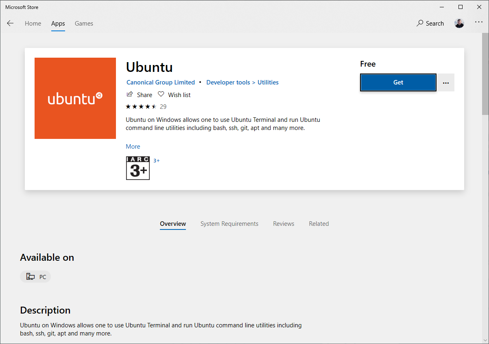
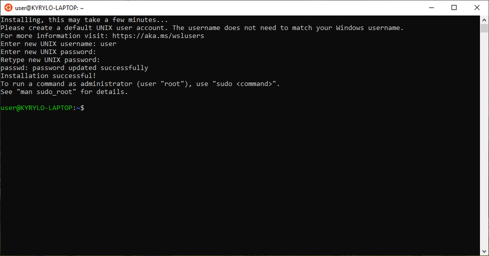
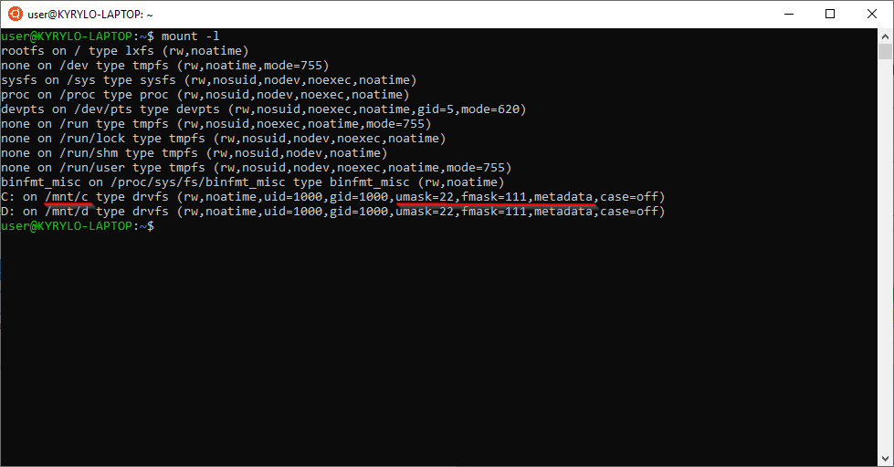

Lorem ipsum dolor sit amet, consectetur adipiscing elit. Curabitur sit amet tortor in diam commodo luctus a sit amet tortor. Sed quis massa mollis, eleifend dolor vitae, vulputate nulla. Duis fringilla ultrices sagittis. Quisque sapien dui, auctor eget lectus nec, egestas gravida nisl. Nam pulvinar venenatis orci condimentum posuere.

---
Integer eu est elit. Pellentesque habitant morbi tristique senectus et netus et malesuada fames ac turpis egestas. Morbi egestas, turpis non cursus pellentesque, risus justo malesuada nunc, ac hendrerit diam nisl ut velit. Donec sollicitudin consequat tincidunt. In sed iaculis nisl. Morbi ac sem non nulla mattis ullamcorper. Ut hendrerit porta rutrum. Integer luctus auctor lacus, eu efficitur nisi pulvinar ac. Nullam dictum vulputate dui id faucibus. Etiam eleifend eget risus sed consequat. Nam dapibus felis feugiat risus accumsan feugiat.

## First header

Proin dictum eleifend neque eget elementum. Donec rutrum sit amet ante aliquet tristique. Integer ut mi erat. Quisque eu neque quis tortor blandit interdum at id eros.

```powershell
Enable-WindowsOptionalFeature -Online -FeatureName Microsoft-Windows-Subsystem-Linux
```

Vestibulum tincidunt tincidunt nisi, non finibus eros volutpat at. Aenean lobortis lacinia lectus eu pharetra. Mauris eget tellus sed ligula scelerisque scelerisque eu sit amet arcu. Etiam quis urna odio. Proin a molestie est, id pharetra massa. Duis ornare, dui ut lobortis pellentesque, purus leo porttitor ex, in finibus tellus dolor ut ante. Duis nec metus nibh. Cras lacinia id diam et commodo. Integer facilisis ornare bibendum. Curabitur euismod arcu risus, ac bibendum nunc iaculis quis. Integer varius eros nec elit fringilla, sed fringilla eros vehicula.



Aliquam blandit finibus velit. Praesent vel lacus gravida, lacinia neque non, tincidunt metus. Phasellus pellentesque in urna sit amet convallis.



## Second header

Nulla vitae sapien non lacus sollicitudin tristique. In hac habitasse platea dictumst. Suspendisse mattis ante eu volutpat interdum. Praesent ullamcorper, augue a ullamcorper porttitor, erat nisl laoreet neque, a dignissim dui odio non leo. Ut sit amet ante at lorem ultricies lobortis.

```raw
([Errno 8] Exec format error). If this is not a script, remove the executable bit from the file.
```

```raw
ERROR: The file [my_inventory] is marked as executable, but failed to execute correctly. If this is not supposed to be an executable script, correct this with `chmod -x [my_inventory]`
```

Vestibulum euismod viverra posuere. Pellentesque posuere nulla vel mattis feugiat. In feugiat, metus id bibendum efficitur, lacus ex mollis lacus, sed dapibus elit ligula ut tortor. Aenean mattis nisi neque, eget venenatis leo consectetur eu. Nam pharetra pharetra malesuada. Cras vitae fringilla lacus, id consectetur lorem.

```bash
sudo nano /etc/wsl.conf
```

Etiam bibendum gravida odio. Proin faucibus ligula et justo faucibus, vel iaculis sapien hendrerit. Sed vel odio vitae ex ullamcorper porta elementum vel arcu. Integer ultrices lacus congue euismod feugiat. Sed tincidunt odio non mauris faucibus suscipit.

```ini
[automount]
enabled = true
options = "metadata,umask=22,fmask=111"
```

Vivamus sagittis ultrices massa, et hendrerit mi euismod eu.

```bash
mount -l
```

Praesent convallis lobortis nisi id varius. Curabitur magna lectus, maximus a ex ornare, mollis sagittis ex.



Sed rutrum turpis non ex faucibus, eget tristique odio tempor. Duis tellus enim, scelerisque eget eros at, aliquet pulvinar odio.

```ini
options = "metadata,uid=1000,gid=1000,umask=22,fmask=111"
```

## Third section

Interdum et malesuada fames ac ante ipsum primis in faucibus. Duis blandit quam a enim semper sodales. Sed eget tellus ante. Ut sed nisl neque. In porttitor dictum commodo. Nulla tincidunt lacinia diam, vitae ultricies ex venenatis a. Phasellus vulputate finibus fermentum.
